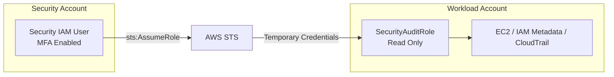

# Project: IAM Cross-Account Access (MFA + STS)

## Overview

This project demonstrates **production‑grade cross‑account access in AWS** using IAM roles, MFA enforcement, and temporary STS credentials. The goal is to eliminate long‑lived credentials, reduce blast radius, and create a design that scales to real multi‑account environments.

This mirrors how security teams operate in mature AWS organizations.

---

## Threat Model

### Primary Threats Addressed

* Leakage of long‑lived access keys
* Over‑privileged IAM users in workload accounts
* Lateral movement between AWS accounts
* Lack of MFA enforcement for sensitive access
* Poor auditability of cross‑account access

### Security Objective

* Enforce **temporary, auditable access**
* Centralize human authentication
* Apply **least privilege** in workload accounts
* Require MFA at the trust boundary

---

## Architecture



---

## IAM Design

### Why Roles Instead of IAM Users

* No shared credentials across accounts
* No permanent secrets in workload accounts
* Reduced blast radius
* Full CloudTrail visibility

### MFA Enforcement

MFA is enforced in the **role trust policy**, not at the service level.

This ensures:

* Stolen access keys alone are insufficient
* Authentication strength is verified before role assumption
* MFA applies consistently across services

### No Access Keys for Human Users

No long‑lived access keys were created for the security IAM user.

Reasoning:

* Console + MFA provides stronger assurance
* STS issues temporary credentials automatically
* Eliminates key leakage risk

This aligns with enterprise security best practices.

---

## Trust Policy (Workload Account)

Key characteristics:

* Trusts **only** the Security Account
* Uses `sts:AssumeRole`
* Requires MFA
* No wildcard principals

> ExternalId was intentionally omitted for console‑based human access. In production, ExternalId would be enforced for programmatic or third‑party access.

---

## Permission Policy (Least Privilege)

The `SecurityAuditRole` is **read‑only**.

Capabilities:

* Infrastructure visibility (EC2, CloudWatch)
* IAM metadata inspection (Get/List only)
* CloudTrail visibility

Explicitly denied:

* IAM modification
* Resource creation
* Data exfiltration

### Validation

* `ec2:DescribeInstances` → allowed
* `iam:CreateUser` → denied

This confirms correct least‑privilege enforcement.

---

## Temporary Credentials (STS)

### How Credentials Are Issued

* Generated by AWS STS during role assumption
* Automatically used by the AWS Console when switching roles

### Properties

* Time‑bound (default 1 hour)
* Non‑reusable after expiration
* Fully logged in CloudTrail
* Not exposed in console UI by design

### Verification

Identity confirmed via STS assumed‑role ARN:

```
arn:aws:sts::<workload-account-id>:assumed-role/SecurityAuditRole/<session-name>
```

---

## Intentional Restrictions

The following were **deliberate security controls**, not misconfigurations:

* CloudShell access denied
* No admin permissions
* No direct console access in workload account
* No long‑lived credentials

---

## Security Outcomes

* Cross‑account access without shared credentials
* MFA enforced at the trust boundary
* Temporary credentials only
* Least privilege validated
* Clear separation of duties

---

## Scaling Considerations

This design scales cleanly as the number of AWS accounts grows.

### Multi‑Account Growth Model

* The **Security Account** remains the single human access entry point
* Each new workload account exposes the same set of standardized roles
* No IAM users are created in workload accounts

### At Scale (20–100+ Accounts)

* AWS Organizations manages account lifecycle
* IAM roles are deployed consistently using **StackSets**
* Service Control Policies (SCPs) restrict:

  * Root usage
  * IAM user creation in workload accounts
  * Disallowed regions and services

### Role Separation

* Separate roles for:

  * Security auditing (read‑only)
  * Incident response (limited write)
  * Break‑glass access (admin, heavily controlled)

This prevents privilege creep and reduces blast radius.

---

## Monitoring & Detection Recommendations

All role assumptions and policy changes are logged via **AWS CloudTrail**.

### High‑Signal Events to Monitor

* `AssumeRole` from unexpected source IPs
* Failed `AssumeRole` attempts (possible brute force)
* Cross‑account role assumption outside business hours
* Changes to role trust policies
* Attachment of overly permissive policies

### Detection Strategy

* Centralize CloudTrail logs in a dedicated logging account
* Create CloudWatch alarms for sensitive IAM events
* Forward logs to a SIEM for correlation and alerting

This enables rapid detection of misuse without granting persistent access.

---

## Conclusion

This project demonstrates how to implement **secure, auditable, least‑privilege cross‑account access** using AWS IAM roles, MFA, and STS.
It reflects real‑world enterprise security practices and avoids common IAM anti‑patterns such as shared credentials and over‑privileged users.

